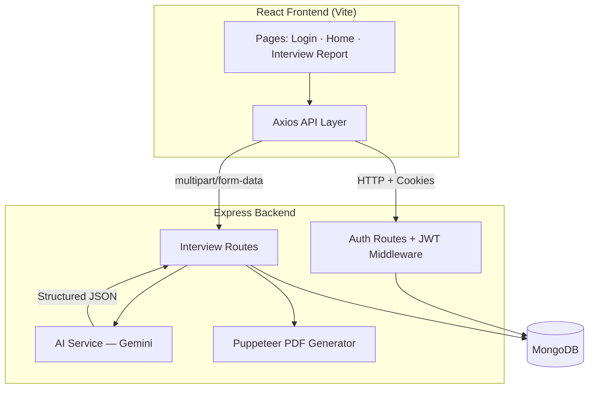

# InterviewAI — AI-Powered Interview Preparation Platform

> Upload your resume, paste a job description, and get a personalized interview strategy in ~30 seconds — powered by Google Gemini.

[](https://react.dev/)
[](https://expressjs.com/)
[](https://www.mongodb.com/)
[](https://ai.google.dev/)

---

## Why this project?

Job interviews are high-stakes and preparation is often generic. **InterviewAI** bridges that gap by analyzing a candidate's profile against a specific job posting and producing actionable, role-specific guidance — not just generic tips.

This project demonstrates end-to-end **full-stack development** combined with **production-minded GenAI integration**: structured JSON output via Zod schemas, PDF parsing, server-side PDF generation, and secure authentication.

---

## Key highlights (for recruiters)

| Area | What I built |
|------|----------------|
| **GenAI integration** | Google Gemini with Zod-validated structured JSON responses (match score, Q&A, skill gaps, prep plan) |
| **Full-stack architecture** | React SPA + REST API + MongoDB with JWT cookie-based auth |
| **File processing** | Resume PDF upload, text extraction, and AI-tailored resume PDF export via Puppeteer |
| **Security** | bcrypt password hashing, HTTP-only cookies, JWT verification, token blacklist on logout |
| **UX** | Protected routes, loading states, expandable question cards, match score visualization |

---

## Features

- **User authentication** — Register, login, logout with session persistence
- **Smart interview reports** — AI-generated match score, technical & behavioral questions with model answers
- **Skill gap analysis** — Severity-tagged gaps (low / medium / high)
- **Day-wise prep roadmap** — Structured multi-day preparation plan
- **Tailored resume export** — Download a job-specific, ATS-friendly resume as PDF
- **Report history** — View and revisit past interview strategies

---

## Tech stack

### Frontend
- React 19 · Vite 7 · React Router 7
- Axios (credentials / cookies)
- SCSS (component-scoped styling)

### Backend
- Node.js · Express 5
- MongoDB · Mongoose
- Google GenAI SDK (`@google/genai`)
- Zod + `zod-to-json-schema` for structured AI output
- Multer (in-memory file upload) · pdf-parse · Puppeteer (PDF generation)
- JWT · bcryptjs · cookie-parser

---

## Architecture



---

## Project structure

```
interview-ai/
├── Backend/
│   ├── server.js                 # Entry point
│   └── src/
│       ├── app.js                # Express app & middleware
│       ├── config/database.js    # MongoDB connection
│       ├── controllers/          # Auth & interview logic
│       ├── middlewares/          # JWT auth, file upload
│       ├── models/               # User, InterviewReport, Blacklist
│       ├── routes/               # API routes
│       └── services/ai.service.js # Gemini + PDF generation
│
└── Frontend/
    └── src/
        ├── features/
        │   ├── auth/             # Login, register, protected routes
        │   └── interview/        # Home, report view, API hooks
        ├── app.routes.jsx
        └── App.jsx
```

---

## Getting started

### Prerequisites

- [Node.js](https://nodejs.org/) v18+
- [MongoDB](https://www.mongodb.com/try/download/community) (local or [Atlas](https://www.mongodb.com/cloud/atlas))
- [Google Gemini API key](https://aistudio.google.com/apikey)

### 1. Clone the repository

```bash
git clone https://github.com/YOUR_USERNAME/interview-ai.git
cd interview-ai
```

### 2. Backend setup

```bash
cd Backend
npm install
cp .env.example .env
# Edit .env with your MongoDB URI, JWT secret, and Gemini API key
npm run dev
```

Server runs at **http://localhost:3000**

### 3. Frontend setup

Open a new terminal:

```bash
cd Frontend
npm install
npm run dev
```

App runs at **http://localhost:5173**

### Environment variables

| Variable | Description |
|----------|-------------|
| `MONGO_URI` | MongoDB connection string |
| `JWT_SECRET` | Secret for signing JWT tokens |
| `GOOGLE_GENAI_API_KEY` | Google Gemini API key |

---

## API overview

| Method | Endpoint | Description | Auth |
|--------|----------|-------------|------|
| `POST` | `/api/auth/register` | Create account | Public |
| `POST` | `/api/auth/login` | Login | Public |
| `GET` | `/api/auth/logout` | Logout & blacklist token | Public |
| `GET` | `/api/auth/get-me` | Current user | Private |
| `POST` | `/api/interview/` | Generate interview report | Private |
| `GET` | `/api/interview/` | List user's reports | Private |
| `GET` | `/api/interview/report/:id` | Get report by ID | Private |
| `POST` | `/api/interview/resume/pdf/:id` | Download tailored resume PDF | Private |

---

## Screenshots

> Add screenshots or a short demo GIF here before sharing with recruiters — visual proof of a polished UI makes a strong first impression.

| Home — Create interview plan | Report — Questions & roadmap |
|------------------------------|------------------------------|
| _screenshot-home.png_ | _screenshot-report.png_ |

---

## What I learned

- Designing **structured LLM outputs** with Zod schemas instead of parsing free-form text
- Building a **secure auth flow** with HTTP-only cookies and token blacklisting
- Handling **file uploads** and PDF text extraction in a Node.js API
- Generating **dynamic PDFs** from AI-produced HTML using Puppeteer
- Organizing a React app with **feature-based folders**, context, and custom hooks

---

## Known limitations & future improvements

- [ ] Add logout button in the UI (backend support exists)
- [ ] Validate resume/self-description before API call
- [ ] Support DOCX resume upload (UI mentions it; backend currently parses PDF only)
- [ ] Environment-based API URL for frontend deployment
- [ ] User-facing error toasts instead of console-only errors
- [ ] Deploy to production (Vercel + Render/Railway + MongoDB Atlas)
- [ ] Add unit/integration tests

---

## License

This project is licensed under the [MIT License](LICENSE).

---

## Author

**Naresh**

- GitHub: [@YOUR_USERNAME](https://github.com/YOUR_USERNAME)
- LinkedIn: [Your LinkedIn](https://linkedin.com/in/YOUR_PROFILE)

---

*Built as a portfolio project demonstrating full-stack development and practical GenAI integration.*
